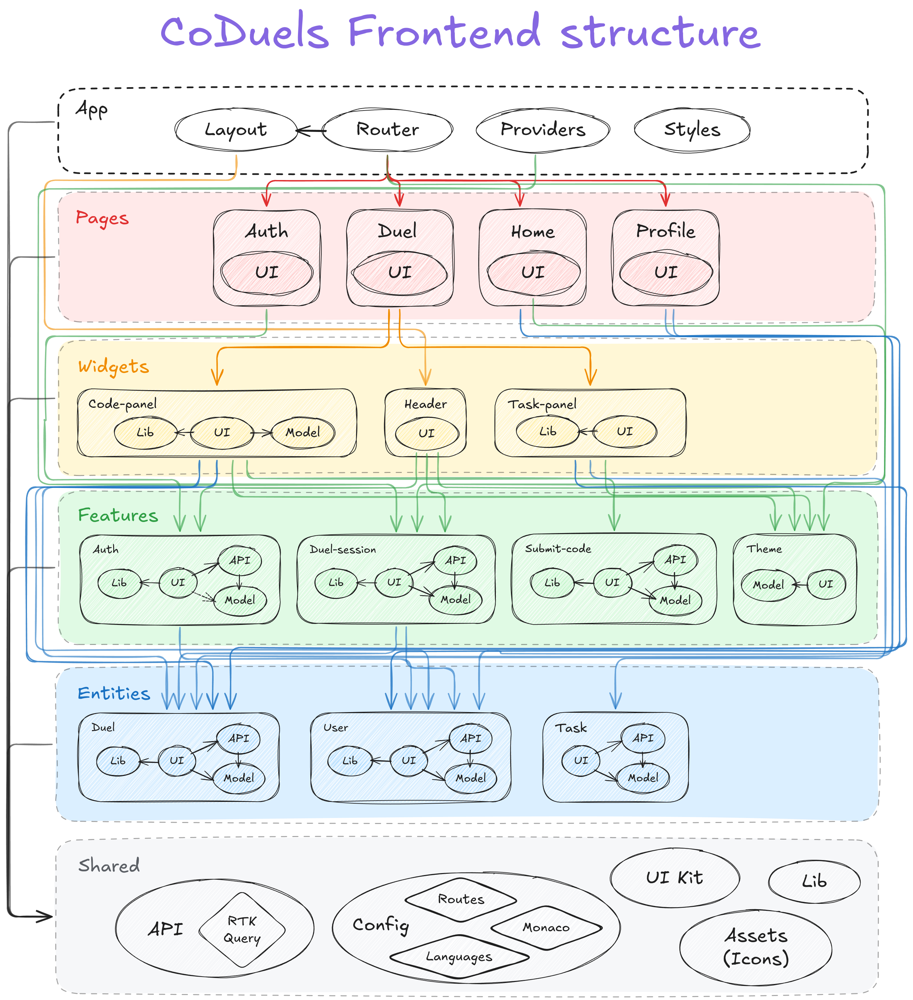

# CoDuels - where algorithms clash

## About

CoDuels is a platform with sports programming competitions. A "duel" competition takes place between two users.

Participants are given one task. The winner is the one who sent the correct solution first.

## Project structure & design

The project is written in React + Redux Toolkit in accordance with the principles of FSD.



Project structure details can be found [here](https://excalidraw.com/#json=hz2r4lYkQCtVQMJ4jLccw,ZOOajM_t6FH7IktUt8kJlA).

Project design can be found [here](https://www.figma.com/design/YJ4S0iifPlgBkFYNWzMaRA/CoDuels?node-id=55-67&t=EethK5xQ6TGTpnx8-1).

## Quick start

To start the project:

- Create `.env` file with following content:

```
VITE_BASE_URL=http://localhost/api # Or any working backend url
```

- Run the following commands:
    - `pnpm install`
    - `pnpm dev`
- Enjoy!

## Scripts

Scripts available in the project:

- `dev`: runs the project with vite in development mode
- `build`: builds the project with vite in production mode
- `lint`: runs eslint on the project
- `lint:fix`: fixes linting errors in the project
- `preview`: runs the project with vite in preview mode
- `fsd:lint`: runs the Feature-Sliced Design linter on the project
- `prettier:fix`: fixes prettier formatting errors in the project
- `prepare`: prepares the project with husky
