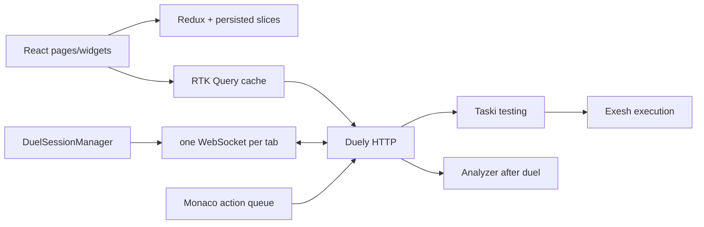

# CoDuels Frontend processes

This directory documents end-to-end client behavior observed in the current
React/Redux code and the corresponding Duely, Taski, Exesh, and Analyzer
contracts. An implementation fact is not automatically a product requirement.

## Process map

| User/client process                                    | Document                                                                         | Primary client owner            |
| ------------------------------------------------------ | -------------------------------------------------------------------------------- | ------------------------------- |
| Store rehydration, theme, routes, protected pages      | [Application bootstrap and routing](application-bootstrap-and-routing.md)        | `app`                           |
| Login, logout, and refresh mutex                       | [Authentication and token refresh](authentication-and-token-refresh.md)          | `features/auth`, `shared/api`   |
| Read-only users, duels, submissions, groups, tournaments | [Admin dashboard](admin-dashboard.md)                                           | admin page/entities             |
| Redux, cache, local/component/browser state catalog    | [Client state ownership](client-state-ownership.md)                              | store and browser               |
| Ticket, socket, events, code sync, two tabs            | [Realtime connection](realtime-connection.md)                                    | `features/duel-session`         |
| Persisted `idle/searching/active` reconciliation       | [Duel session lifecycle](duel-session-lifecycle.md)                              | duel-session slice/manager      |
| Start/cancel rating search                             | [Ranked matchmaking](ranked-matchmaking.md)                                      | Home/session button             |
| Friendly, group-membership, and tournament invitations | [Duel invitations](duel-invitations.md)                                          | Home and invitation APIs        |
| Membership, roles, permissions, sections               | [Groups](groups.md)                                                              | group pages/entities            |
| Manager-created two-user duels                         | [Group duels](group-duels.md)                                                    | Group page                      |
| Create/start/bracket/duel invitations                  | [Tournaments](tournaments.md)                                                    | group/tournament pages          |
| Duel access, nested routes, tasks opening              | [Duel page and task navigation](duel-page-and-task-navigation.md)                | Duel page/widgets               |
| Monaco persistence and opponent synchronization        | [Editor state and code sync](editor-state-and-code-sync.md)                      | code panel/session socket       |
| Submit and reconcile judging state                     | [Submissions](submissions.md)                                                    | submit-code and task panel      |
| Capture/batch behavior actions                         | [Anti-cheat actions](anti-cheat-actions.md)                                      | anti-cheat feature              |
| Endpoint cache keys/tags/manual changes                | [RTK Query cache](rtk-query-cache.md)                                            | shared API slice                |
| Browser persistence and tab conflicts                  | [Reload recovery and multiple tabs](reload-recovery-and-multiple-tabs.md)        | redux-persist/storage           |
| Cross-process degraded paths                           | [Failure handling](failure-handling.md)                                          | all layers                      |
| HTTP and WebSocket field compatibility                 | [Backend contracts](backend-contracts.md)                                        | Frontend plus backend producers |
| Windows/WSL toolchain and production-bundle checks     | [Local Windows/WSL development and verification](local-windows-wsl-toolchain.md) | local development environment   |

Use the [glossary](glossary.md) to distinguish local session, RTK cache, backend
state, and browser-storage scopes. Unresolved intent and confirmed/potential
defects are consolidated in [open questions](open-questions.md).

## Current production data path

Taski/Exesh production status propagation is REST polling inside the backend;
the browser sees derived Duely WebSocket messages, not their raw histories.

## Test and validation baseline

Vitest covers selected UI helpers and duel-session realtime/state behavior.
There is no committed browser E2E suite or Storybook; `msw` is installed but has
no shared handler fixture. The standard source checks are `pnpm test`,
`pnpm lint`, `pnpm fsd:lint`, and `pnpm build`, followed by the required
production-bundle Chrome smoke test before Frontend publication. See the
[Windows/WSL runbook](local-windows-wsl-toolchain.md) when Codex supplies the
Windows toolchain. No Markdown-lint configuration is present.

## Manual verification handoff

After every Frontend task, the Pull Request description and final handoff must
contain a short **What to test manually** section. Keep it actionable rather than
restating the implementation:

1. State the required account, permissions, or test data.
2. Name the route or screen and the exact actions to take.
3. State the expected visible result.
4. Add one or two nearby regression checks when they are relevant.

If the change has no meaningful browser interaction, say that explicitly and
name the automated or non-UI check that replaces the click-through.
