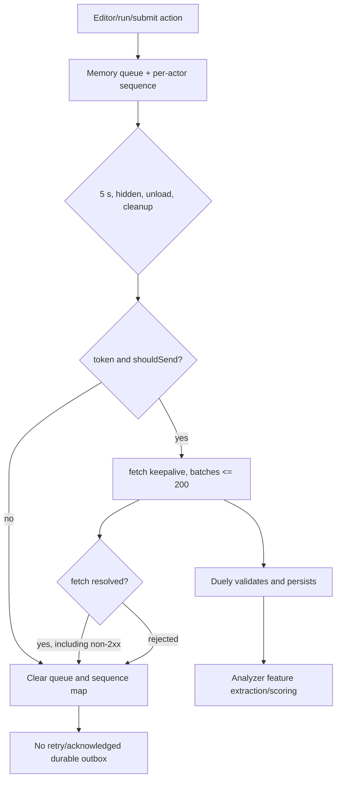

# Anti-cheat actions

## Purpose

Describe browser behavior-action capture, event shape, in-memory batching,
flush/loss semantics, and the contract with Duely and Analyzer.

## Participants

Monaco/action hooks, run and submit controls, anti-cheat queue module, DuelPage,
auth/duelSession state, browser lifecycle, Duely action endpoint/storage, and
Analyzer after the duel.

## Entry points

Choose language, write/delete/paste/cut, move cursor, run sample/custom test,
submit, 5-second interval, page hide/unload, visibility hidden, component
cleanup, token loss, reload, socket/session changes, and backend rejection.

## Preconditions

Tracking is enabled for a known participant. Each event needs duel/user/task
context as applicable. Sending additionally uses a predicate based on local
`phase=active` and a current token; Duely performs definitive validation.

## Current behavior

Exact action types are `ChooseLanguage`, `WriteCode`, `DeleteCode`, `PasteCode`,
`CutCode`, `MoveCursor`, `RunSampleTest`, `RunCustomTest`, and `SubmitSolution`.
Events contain UUID `event_id`, per `${duelId}:${userId}` `sequence_id`, ISO
timestamp, duel/user/type and optional task/action fields. They live only in a
module-memory queue. Flush is triggered every 5 seconds and on lifecycle events,
sends batches up to 200 using `fetch(..., keepalive: true)`, and does not inspect
`response.ok`. `sendBeacon` is not used.

Flush returns while another flush runs. If `shouldSend` is false, fetch rejects,
the token disappears, or the response is non-2xx, `finally` clears the whole
queue and sequence map; there is no retry. Events added while flushing can be
included in another loop iteration or removed by final cleanup. Sequence IDs
therefore restart after every flush rather than remaining monotonic for a duel.

## Client state transitions

Capture appends and increments a memory counter. Flush sets `isFlushing`, slices
and sends, then always empties queue/counters and clears the flag. Token-change
effects clear queued data. Participant page with local phase idle can capture
actions that are discarded on the next disabled flush.

## Backend state assumptions

Duely verifies authenticated user against payload, unfinished duel, membership,
UUID, positive sequence, timestamp, duel ID, and one-character task key, then
persists accepted events. Analyzer expects synchronized action names/fields and
ordered feature input. Client-generated identity/sequence is not trusted truth.

## State ownership

The browser owns unsent memory only. Duely owns accepted durable actions and
deduplication constraints. Analyzer owns derived features/score. Neither Redux
nor browser storage retains the queue; no client receipt proves persistence.

## UI effects

Tracking is invisible and failures do not block editor/run/submit or notify the
user. Spectator editing paths are disabled in UI. Local active-phase mismatch can
silently remove participant events even while the duel is valid backend-side.

## Network effects

Batches use raw authenticated fetch rather than RTK Query/refresh mutex. A stale
access token can fail without refresh/retry. Lifecycle `keepalive` is best effort
and payload/platform limits apply; it is not a delivery guarantee.

## Idempotency and duplicate handling

UUID event IDs allow backend deduplication if a batch is retried, but the client
does not retry. Sequence restarts create repeated low values across batches;
ordering must not assume global monotonicity. Concurrent tabs create independent
UUID/sequence streams for the same duel/user.

## Ordering assumptions

Actions are queued in callback order within one JS context, but asynchronous
flushes, events added during flush, debounced editor updates, system clocks, and
tabs have no global order. Analyzer must not infer strict chronology solely from
restarting sequence IDs.

## Failure handling

Non-2xx is treated as successful delivery because only promise rejection is
observable and both paths clear data. Rejection, offline, unload limits, reload,
crash, and disabled sending all lose events. No backoff, durable outbox, metric,
receipt, or user-visible signal exists.

## Reload and multiple tabs

Reload/crash discards queue and resets sequences. Each tab captures and flushes
independently; socket replacement does not coordinate anti-cheat. Shared editor
state can produce action streams that do not correspond to a single ordered
editing session.

## Implementation references

- anti-cheat action types/queue/hooks under `src/features/anti-cheat`
- Monaco action tracking integration under `src/widgets/code-panel`
- run/submit action call sites
- `src/pages/duel` participant/active gating
- Backend Duely user-action DTO/use case and Analyzer schemas/features

## Test coverage

- **Existing tests:** none.
- **Needed unit/integration:** every action payload, batches 1/200/201, non-2xx,
  rejection, events-during-flush, token change, sequence/dedup validation.
- **Needed E2E:** real editing/run/submit order, offline/reload/close/hidden,
  inactive phase, two tabs, refresh expiry, and Analyzer-compatible dataset.

## Current guarantees

Known actions receive UUIDs and ISO timestamps; a normal eligible online flush
sends no more than 200 per request in queue order; Duely revalidates identity and
domain constraints; action types currently match the Analyzer contract.

## Open questions

Required delivery rate, sequence scope, retry/retention/privacy policy, accepted
response schema, clock handling, cross-tab semantics, and observability thresholds
must be defined before calling this reliable telemetry.

## Proposed requirements

Check HTTP status and use acknowledged retry with bounded durable/user-scoped
outbox; keep monotonic stream sequence/revision; serialize concurrent flushes;
coordinate tabs; refresh auth safely; publish loss metrics; contract-test Duely
and Analyzer schemas; never claim unload delivery is guaranteed.

