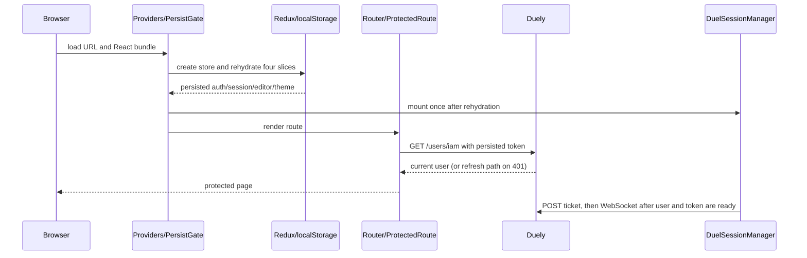

# Application bootstrap and routing

## Purpose

Create the client runtime, restore persisted state, apply theme, protect routes,
mount the single duel-session manager, and render the selected page.

## Participants

Browser, React StrictMode/root, Providers, Redux store/API middleware,
redux-persist/PersistGate, ErrorBoundary, AppRouter, DuelSessionManager, Layout,
ProtectedRoute, pages/widgets, RTK Query, and Duely.

## Entry points

Initial URL load, reload, history navigation, auth-state rehydration, logout,
route error, or direct deep link.

## Preconditions

`#root` exists, bundles/configured `VITE_BASE_URL` load, and persisted JSON is
readable enough for redux-persist or reducers can use initial state.

## Current behavior

`main.tsx` mounts `<App/>` in StrictMode. Store construction registers persisted
auth, duelSession, codeEditor, theme reducers; the unpersisted RTK Query reducer;
and API middleware, then creates the persistor. Providers wrap the application
in ErrorBoundary, Redux Provider, and PersistGate with `loading=null`, so routes
do not render until bootstrapping completes and the page can be blank meanwhile.

AppRouter reads persisted theme, applies `.app--{mode}`, mounts exactly one
DuelSessionManager outside RouterProvider, then starts the browser router.
Layout always renders Header and Outlet. Suspense uses Loader for route elements,
although pages are currently static imports. Root `errorElement` is Fallback.

`/auth` is public even when already authenticated. Protected routes are `/`,
`/profile/:userNickname`, `/groups`, `/groups/:groupId`,
`/groups/:groupId/members`, `/groups/:groupId/duels`,
`/groups/:groupId/tournaments`,
`/groups/:groupId/tournaments/:tournamentId`, and `/duel/:duelId` with nested
`/duel/:duelId/description`, `/duel/:duelId/submissions`, and
`/duel/:duelId/submissions/:submissionId`; duel index redirects to `description`.
`/groups/:groupId` redirects to `members`. ProtectedRoute skips
`getMe` without token, redirects to `/auth`, and with a token waits for `getMe`.
Only explicit 401 redirects; any other error remains Loader indefinitely. It
does not preserve the original URL. RTK cache is recreated empty on reload.

## Client state transitions

`persist bootstrap: pending -> rehydrated`; `auth.user: persisted/null -> getMe
result`; route `requested -> Loader/redirect/page/Fallback`. No persisted RTK
cache transition exists.

## Backend state assumptions

Persisted token/user are provisional. `GET /users/iam` authenticates protected
pages and can trigger refresh. Duel/session reconciliation is separate and
route-dependent; direct duel access relies on `GET /duels/:id` authorization.

## State ownership

| State                | Owner/source of truth | Redux       | RTK Query | local state | sessionStorage  | localStorage       | Survives reload |
| -------------------- | --------------------- | ----------- | --------- | ----------- | --------------- | ------------------ | --------------- |
| Tokens/user snapshot | Duely; client cache   | auth        | getMe     | No          | No              | `persist:auth`     | Yes             |
| Theme                | client preference     | theme       | No        | No          | No              | `persist:theme`    | Yes             |
| Route/location       | browser router        | No          | No        | router      | No              | No                 | URL yes         |
| API cache            | HTTP responses        | API reducer | Yes       | No          | No              | No                 | No              |
| Modal/page state     | component             | Usually no  | No        | Yes         | Some Home state | Some explicit keys | Key-dependent   |

## UI effects

PersistGate shows blank during rehydration. Suspense/protected queries show
Loader. Missing token/401 redirects with `replace` to `/auth`; network failure
can show endless Loader. Group/duel nested redirects replace history. Invalid
or thrown route renders generic Fallback; invalid numeric duel IDs lack a
dedicated parent error view.

## Network effects

ProtectedRoute subscribes to cached `getMe`; auth refresh can replay it. Manager
starts ticket/socket only after both `auth.user` and the access token are
present, and owns active-duel reconciliation. Header/child pages may start their
own queries after route render. No cache is restored from disk.

## Idempotency and duplicate handling

StrictMode may replay effects in development. The manager effect cleanup fully
stops the first realtime lifecycle before the replay starts the replacement.
Unmount, logout, and same-runtime identity changes use the same cleanup path.

## Ordering assumptions

PersistGate orders rehydration before AppRouter/managers/queries. Both token and
current user must be present before the manager starts realtime; a later token
transition from missing to present starts it without requiring a user-ID change.
Route navigation and cache responses are otherwise asynchronous; no transaction
binds them.

## Failure handling

ErrorBoundary catches render errors. Storage parsing has library/default
fallback behavior but no app migration UI. Missing base URL/network can cause
getMe Loader, refresh/logout, or page errors. No explicit offline route, retry
button, 404 page, or original-location return exists.

## Reload and multiple tabs

Each tab builds its own store/router/cache/manager/socket. localStorage is
shared but Redux is not live-synchronized; sessionStorage is tab-scoped. Reload
rehydrates slices and empties cache; PersistGate prevents a flash of reducer
initial state. A second tab can replace the first backend socket.

## Implementation references

- `src/main.tsx`, `src/app/{App,store}.tsx`, `src/app/store.ts`
- `src/app/providers/Providers.tsx`
- `src/app/router/{AppRouter,router,ProtectedRoute,GroupRedirect}.tsx`
- `src/app/layout/Layout.tsx`
- `src/shared/config/routes/appRoutes.ts`

## Test coverage

- **Existing tests/MSW:** none; MSW has no handlers.
- **Needed unit/integration:** persist configs, ProtectedRoute result matrix,
  router paths/redirects, error boundary, manager mount/unmount.
- **Needed browser/E2E:** authorized cold load, corrupt/old storage, offline
  getMe, deep links, invalid IDs/403, reload, logout redirect, StrictMode, and
  two-tab bootstrap.

## Current guarantees

PersistGate blocks child rendering until redux-persist bootstraps; four named
slices (not RTK cache) are version-1 persisted; one manager is present in the
normal AppRouter tree; all non-auth declared pages use ProtectedRoute.

## Open questions

Desired offline/404/original-route UX, persistence migration, manager abnormal
remount cleanup, and whether authenticated users may visit `/auth` are unclear.

## Proposed requirements

Define route/error/offline recovery, preserve intended deep links through auth,
version/migrate persisted state, add explicit manager cleanup, validate IDs and
authorization states, and cover cold/reload/two-tab bootstrap with E2E tests.
