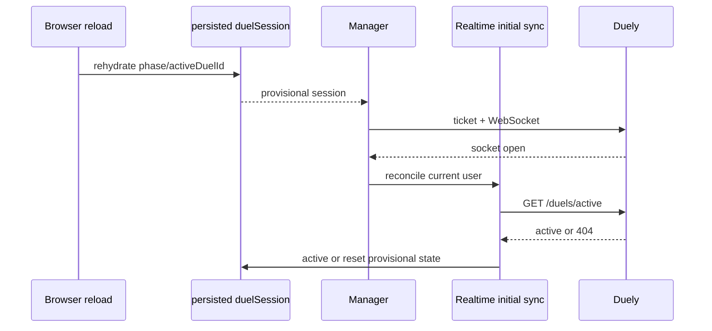

# Duel session lifecycle

## Purpose

Coordinate local `idle`, `searching`, and `active` UI workflow with backend
pending/active duels across HTTP, socket events, logout, disconnect, and reload.

## Participants

Duel-session slice/thunk/manager/button, Home/Group pages, RTK duel endpoints,
redux-persist, WebSocket handlers, router, and Duely pending/active duel state.

## Entry points

Start/accept/cancel click, `DuelStarted`/finished/canceled/invitation events,
`getActiveDuel` response, reload/browser reopen, direct duel URL, socket close,
logout, or persisted rehydration.

## Preconditions

Authenticated user for backend operations. `searching` should correspond to a
backend pending state; `active`/ID should correspond to an InProgress duel, but
reducers do not enforce these invariants.

## Current behavior

Exact phases are `idle`, `searching`, `active`. `setPhase("idle")` clears active
ID, matching fields, and task snapshots; other values do not validate required
fields. `setActiveDuelId(non-null)` changes searching/idle to active, clears
matching/task notification state; null clears event/task state but does not
itself set phase.

`resetDuelSession` clears every field including unpersisted interrupted/task
state. Logout and same-runtime user changes invoke it. A disconnected socket
resets searching to idle because Duely cancels pending state on connection
cleanup, then automatic reconnect begins. Finish resets only when its duel ID is
the current active ID, so a duplicate or delayed finish cannot clear another
active duel.

The globally mounted realtime session runs `/duels/active` after every initial
connect and reconnect. An in-progress result promotes the session to active. If
that endpoint returns 404 for a user-owned active or pending-result candidate,
the client verifies the exact duel detail before keeping a finished result;
otherwise it resets provisional persisted active/searching state. The manager also owns
the active-duel query and polls it every two seconds while locally searching,
so a missed start event still promotes the session without waiting for a socket
reconnect. Its ordinary 404 also verifies a persisted active ID through duel
detail even when the socket never opens. Ownerless IDs from the previous
persisted schema are provisional candidates and survive only after participant
validation. Every asynchronous reset is fenced by the candidate that started
it, so an older verification cannot clear a newer duel. While the user is
viewing their active duel, DuelInfo also polls that exact detail every two
seconds. A finished HTTP snapshot consumes the same user-owned active transition
as `DuelFinished`, so a silently missed socket event does not require F5.

`setPhase("searching")` is ignored once an active ID exists. This fences the
race where an early `DuelStarted` arrives before the search/accept HTTP response
and that later response tries to put the already-active session back into
searching. `DuelStarted` is accepted while searching and also by an unfenced
idle sibling tab, so a duel created in another tab remains reachable. Leaving a
search sets a short-lived cancellation fence for late start events; after that
window, the idle tab again accepts an authoritative start from a sibling tab.
Navigation from searching to active still belongs to mounted workflow
components; the socket manager itself does not navigate.

## Client state transitions

- Ranked/friendly/accept success: `idle -> searching`.
- `DuelStarted`: `searching|unfenced idle -> active`, non-null active ID.
- cancel success/socket close while searching: `searching -> idle`.
- finish: matching user-owned `active -> idle`, ID null, pending result recorded.
- acknowledgement/logout/reset: pending result cleared; logout/reset also returns
  `active|searching|idle -> idle`.
- `getActiveDuel` creates the consistent `active + activeDuelId` transition.

## Backend state assumptions

Backend pending types and active Duel are authoritative. `GET /duels/active` and
`GET /duels/:id` are partial reconciliation. Disconnect cancels pending states.
No endpoint verifies "searching" directly, and persisted matching fields are
not compared with backend pending rows.

## State ownership

| State                          | Owner/source of truth     | Redux       | RTK Query        | local state    | sessionStorage | localStorage          | Survives reload          |
| ------------------------------ | ------------------------- | ----------- | ---------------- | -------------- | -------------- | --------------------- | ------------------------ |
| Pending/search                 | Duely; client phase cache | duelSession | invitation lists | No             | waiting flag   | `persist:duelSession` | Yes, conditionally reset |
| Active duel                    | Duely                     | ID/phase    | active/detail    | No             | No             | persisted ID/phase    | Yes                      |
| Matching fields                | client correlation        | duelSession | invitation DTOs  | No             | No             | persisted             | Yes                      |
| Interrupted/task notifications | client                    | duelSession | Duel data        | manager/modals | No             | Not whitelisted       | No                       |
| Pending result                 | terminal event + Duely    | duelSession | duel detail      | DuelInfo       | No             | persisted, user-owned | Yes, then revalidated    |

## UI effects

Home shows idle controls or search loader; session button starts/cancels/navigates.
Canceled/denied opens modal. Active event can navigate only where workflow effects
are mounted. Direct active/finished pages render independently of phase. Socket
close can show idle Home plus blocking interruption modal.

## Network effects

Start/cancel/accept mutations precede most local phase changes. Manager performs
active/detail GETs and polls the active endpoint while searching. Socket events
invalidate duel data. Post-close reconnect is automatic with backoff, and every
open performs active-session and broad cache reconciliation. There is still no
pending-status endpoint or event replay.

## Idempotency and duplicate handling

Supplied event IDs are deduplicated and numeric cursors are monotonic. Current
Duely sends no cursor, so relevance checks protect active transitions and result
creation is locally idempotent. A duplicate finish cannot recreate an
acknowledged result after the active transition is consumed. Multiple HTTP
requests can still create/cancel competing backend state. Persisted active and
pending-result state carries a user ID, and the runtime socket lifecycle is keyed
and fenced by the current authenticated user ID.

## Ordering assumptions

HTTP mutation success is usually observed before the related socket event. An
early start cannot be overwritten by a later `setPhase(searching)` once the
active ID is present. Finish is assumed to concern the current active duel. Home
navigation assumes phase transition occurs after the watcher mounts.

## Failure handling

Mutation errors generally leave prior phase. Lost success responses and missed
start events are repaired by the searching-time `/duels/active` poll or the next
connect/reconnect sync. Pending invitation/search state still has no complete
backend status query.

## Reload and multiple tabs

ID/phase/matching and pending result persist in shared localStorage; each tab has
independent Redux and socket. Result acknowledgement uses a user/duel-scoped key
and storage events to clear matching pending state across tabs. Reload searching
resets local idle, while backend old-socket cleanup
also cancels pending. Browser reopen may retain stale search. One tab's start/
finish/logout does not update another except through backend events/storage races.

## Implementation references

- `src/features/duel-session/model/{duelSessionSlice,thunks,types}.ts`
- `src/features/duel-session/ui/{DuelSessionManager,DuelSessionButton}`
- `src/pages/home/ui/HomePage.tsx`
- `src/entities/duel/api/duelApi.ts`
- CoDuels-Backend: `docs/processes/duel-lifecycle.md`

## Test coverage

- **Existing tests:** realtime integration covers connect/reconcile, disconnect,
  retry, duplicate/unknown events, logout cleanup, user-session replacement,
  terminal result transitions, and reconnect candidate validation.
- **Needed unit/integration:** remaining reducer invariants and full active-query/
  restore error matrices.
- **Needed browser/E2E:** all three phases, reload/reopen/direct URL, response
  loss, missed start/finish, logout/disconnect, active event on other page, and
  two tabs.

## Current guarantees

Only three phase strings compile; whitelisted session fields survive reload;
non-null active ID promotes idle/searching to active; reset clears all session
fields; every socket open globally reconciles `/duels/active`; searching polls
the same authoritative endpoint every two seconds.

## Open questions

Global navigation, a backend pending-state query, browser reopen before socket
open, cursorless event relevance, and multi-tab authority remain undefined.

## Proposed requirements

Represent backend-verified pending generation/type, publish event revisions,
navigate by an explicit global policy, scope persistence by user, and test every
persisted/inconsistent state in a browser environment.
