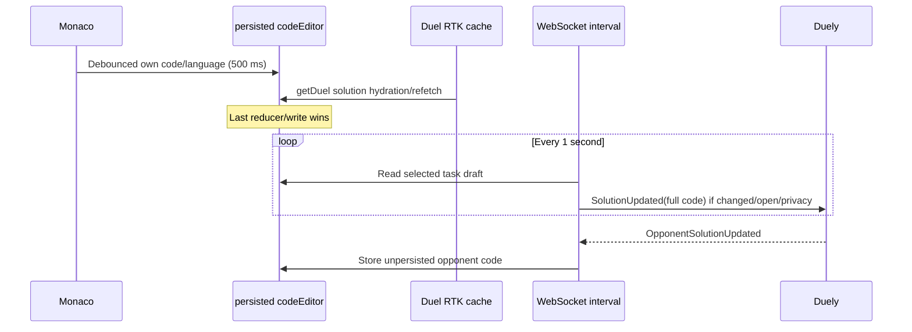

# Editor state and code sync

## Purpose

Describe Monaco draft ownership, language mapping, server-solution hydration,
privacy-based opponent view, and WebSocket solution synchronization.

## Participants

CodePanel/Monaco, codeEditor persisted Redux slice, duel/task RTK cache,
duel-session interval, authenticated participant/spectator, opponent, Duely
WebSocket/use cases, and browser tabs.

## Entry points

Open/switch task, type/delete/paste/cut/change language, load/refetch a duel,
switch my/opponent tab, receive `OpponentSolutionUpdated`, reload/logout, finish
duel, reconnect, or edit from another tab.

## Preconditions

A valid duel/task is loaded. Participant/status/privacy determines allowed UI.
Client language values `cpp`, `go`, `python` map to API values `Cpp`, `Golang`,
`Python`. Duely performs final participant/status/privacy authorization.

## Current behavior

Own code/language is stored under `${duelId}:${taskId}` and persisted. Monaco
keeps local state and debounces Redux updates for 500 ms. `getDuel.fulfilled`
hydrates solutions and can overwrite an existing persisted draft; a pending
debounce may then overwrite that response. Opponent values are unpersisted.
The selected `my/opponent` tab is sessionStorage key `duel.{duelId}.codeTab` and
privacy forces `my` when opponent view is unavailable. Read-only mode also
blocks copy/cut/context menu.

Every second, the session manager chooses active/route duel and selected/first
task, reads code/language, requires an open socket and cached duel privacy, and
sends a full `SolutionUpdated` payload when different from one `lastSent` value.
It does not explicitly require participant identity, active phase, or unfinished
status; backend rejects invalid sends. Incoming opponent updates require a
privacy-enabled cached duel, map task key to ID, and update opponent state.

## Client state transitions

Typing changes Monaco immediately and Redux later. Task switch changes the key
and causes the interval to resend that task because `lastSent` is a single
payload. Logout empties own/opponent maps. Duel finish does not prune code. A
Duel refetch can replace own code/language with backend solution state.

## Backend state assumptions

Duely owns the latest accepted synchronized solution and enforces user, duel,
task-key, privacy, participant, and status rules. The client assumes one-character
task keys and compatible language strings. WebSocket synchronization is not an
authoritative save acknowledgement.

## State ownership

The active local draft is client-owned until a backend response/refetch is
applied; current code has no explicit conflict policy. Persisted Redux stores own
drafts, unpersisted Redux stores opponent drafts, RTK stores received duel
solutions, Monaco mirrors the selected draft, and Duely owns accepted shared data.

## UI effects

Participants can edit while eligible; spectators/opponent tab are readonly.
Privacy controls whether opponent tab is offered. There is no visible dirty,
syncing, acknowledged, rejected, or conflict indicator, so a user cannot tell
whether the latest edit reached Duely.

## Network effects

The interval sends the entire solution, not deltas, over the authenticated
socket. Switching task/language resends. Last edits made just before close may
never be sent. Incoming updates patch Redux only, not RTK duel solutions.

## Idempotency and duplicate handling

Identical consecutive payloads in one manager instance are suppressed by
`lastSent`. There is no message ID/version/acknowledgement; reconnect/remount/task
switch may resend. Backend must tolerate duplicate full-state updates. Two tabs
can alternately overwrite the same solution.

## Ordering assumptions

Local debounce, HTTP duel hydration, one-second socket send, opponent events,
and other tabs are unordered. The code implicitly uses arrival/last-write wins,
without revision comparison. An incoming update can target any cached private
duel/task and is not checked against the current route/active ID.

## Failure handling

Closed socket skips sends without durable queue. Backend rejection is not shown.
Reload preserves own draft but loses last-sent/opponent state; next eligible
interval can resend. Malformed/unknown task updates are ignored. No final flush
is guaranteed on navigation or unload.

## Reload and multiple tabs

Own code/language survives in shared localStorage, but each tab has independent
Redux/Monaco state and persist writes. Opponent state and sync marker disappear.
Tabs do not listen for storage changes and can overwrite each other's draft and
backend solution. Logout in one tab is not an atomic purge in the others.

## Implementation references

- codeEditor slice and CodePanel under `src/widgets/code-panel`
- `src/features/duel-session/api/duelSessionApi.ts`
- duel API `getDuel` hydration reducer
- Monaco action tracking hooks under anti-cheat features
- Duely solution-update WebSocket handler/use case

## Test coverage

- **Existing tests:** none.
- **Needed unit/integration:** language mapping, debounce/refetch order, privacy,
  task switch, duplicate suppression, invalid event/task, logout cleanup.
- **Needed E2E:** edit/reload/offline/close, two tabs/users, spectator attempts,
  opponent updates, backend rejection, duel finish, and reconnect conflicts.

## Current guarantees

Own keyed drafts normally survive reload and clear on local logout; normal
private participant sessions send changed full solutions at most once per
interval; backend remains the security boundary; opponent data is not persisted.

## Open questions

Conflict winner, save acknowledgement/revision, retention after duel, cross-tab
ownership, final-flush expectation, copying restrictions, and precise privacy
semantics need explicit product requirements.

## Proposed requirements

Define versioned server/client solution revisions and acknowledgements; gate
sends by verified participant/status; scope/prune encrypted or safer persistence;
coordinate tabs; preserve unsent drafts; expose sync state; and test all races.

