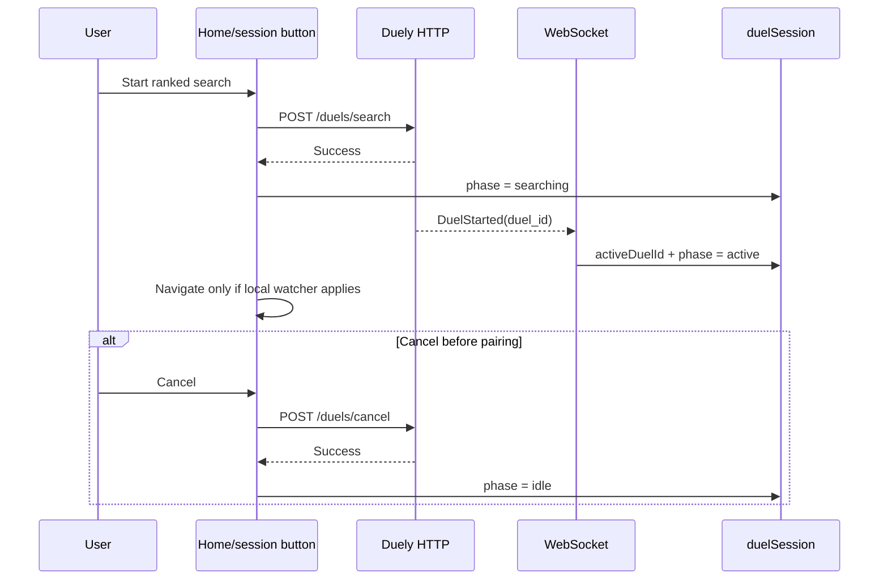

# Ranked matchmaking

## Purpose

Describe how a user starts and cancels rating-based matchmaking and how the
client turns a backend-created duel into an active browser session.

## Participants

Home quick-search controls, `DuelSessionButton`, duel-session Redux slice and
manager, RTK Query duel API, authenticated WebSocket, Duely, and browser tabs.

## Entry points

The Home quick-search action, the header/session button, cancel controls, a
`DuelStarted` event, reconnect/reload, and logout.

## Preconditions

The user has an access token and chooses a usable duel configuration. Duely,
not the client, decides eligibility, rating pairing, and whether a pending
search can be created or canceled.

## Current behavior

Both start controls clear persisted invitation matching fields, call
`POST /duels/search`, and set `phase=searching` only after a successful response.
Cancel calls `POST /duels/cancel` and then moves to `idle`. A `DuelStarted`
message stores the duel ID and activates the session. Navigation is conditional:
the session button watches its own transition, while Home navigates only when
its local/session `waitingForStart` flag is set. Search actions are not globally
serialized and a rapid double click can issue duplicate requests.

## Client state transitions

Nominally `idle -> searching -> active -> idle`. Start clears opponent,
configuration, invitation type, and tournament matching values. An early
`DuelStarted` can set `active` before the start response; the late success
handler then writes `searching` while retaining `activeDuelId`, producing an
inconsistent persisted state. Socket close converts `searching` to `idle`.

## Backend state assumptions

The backend owns the queue, pairing, pending-duel cleanup, and created duel.
Client `phase` is only a projection. Starting ranked search may also invalidate
other pending friendly state on the backend even though the UI does not refresh
all invitation data immediately.

## State ownership

Duely owns whether the user is searching and the resulting active duel.
Persisted duel-session fields own UI continuity only. Component mutation flags
own temporary spinners; RTK cache owns received duel/configuration snapshots.

## UI effects

Searching shows a cancel state. Active state may expose a session button or
trigger navigation from the control that initiated the flow. A start event on
an unrelated page does not guarantee global navigation. Rejected mutations
leave the previous local phase and surface endpoint-specific errors.

## Network effects

Start and cancel are authenticated HTTP mutations. Pairing completion arrives
by WebSocket. Cancel invalidates invitation/group-related tags, but the generic
`Tournament/LIST` key does not match the tournament tags actually provided.

## Idempotency and duplicate handling

No client idempotency key is sent. Mutation loading state narrows but does not
eliminate rapid duplicate requests. Repeated `DuelStarted` assignments are
mostly reducer-idempotent, but an old event can reactivate the wrong duel.

## Ordering assumptions

The implementation assumes the start response precedes `DuelStarted` and the
cancel response precedes any pairing event. Neither order is encoded in an
event ID, search generation, or compare-and-set transition.

## Failure handling

A lost successful start response leaves the backend searching while the client
stays idle. A lost successful cancel response leaves the client searching. A
failed ticket/constructor/connect attempt before the first socket open preserves
local searching state. After an established socket closes, local search is reset;
backend disconnect handling is expected to cancel pending work. There is no
status endpoint dedicated to reconciliation.

## Reload and multiple tabs

Reload preserves `searching`, but the manager resets a searching session with
no active duel to idle on reload/navigation without first verifying/canceling
backend state. Each tab can start/cancel independently and receives a competing
socket lifecycle; no tab owns the search generation.

## Implementation references

- `src/pages/home/ui/HomePage.tsx`
- `src/features/duel-session/ui/DuelSessionButton.tsx`
- `src/features/duel-session/model/duelSessionSlice.ts`
- `src/features/duel-session/api/duelSessionApi.ts`
- `src/entities/duel/api/duelApi.ts`

## Test coverage

- **Existing tests:** none.
- **Needed integration:** response/event in both orders, response loss, duplicate
  start/cancel, stale start event, rejected eligibility, tag invalidation.
- **Needed E2E:** start/cancel from both controls, reload while searching,
  navigate away before pairing, disconnect, and two-tab races.

## Current guarantees

The client does not mark search active before the HTTP start succeeds; a normal
current `DuelStarted` stores its ID; a successful cancel returns local phase to
idle; logout resets the duel-session slice.

## Open questions

The canonical pending-search status, global navigation policy, idempotency key,
event generation, and precedence between ranked and invitation flows are not
defined in the client contract.

## Proposed requirements

Expose a backend session/search identifier and status query; make transitions
generation-aware and order-independent; disable/serialize duplicate actions;
reconcile after reload/reconnect; and define one global navigation policy.
