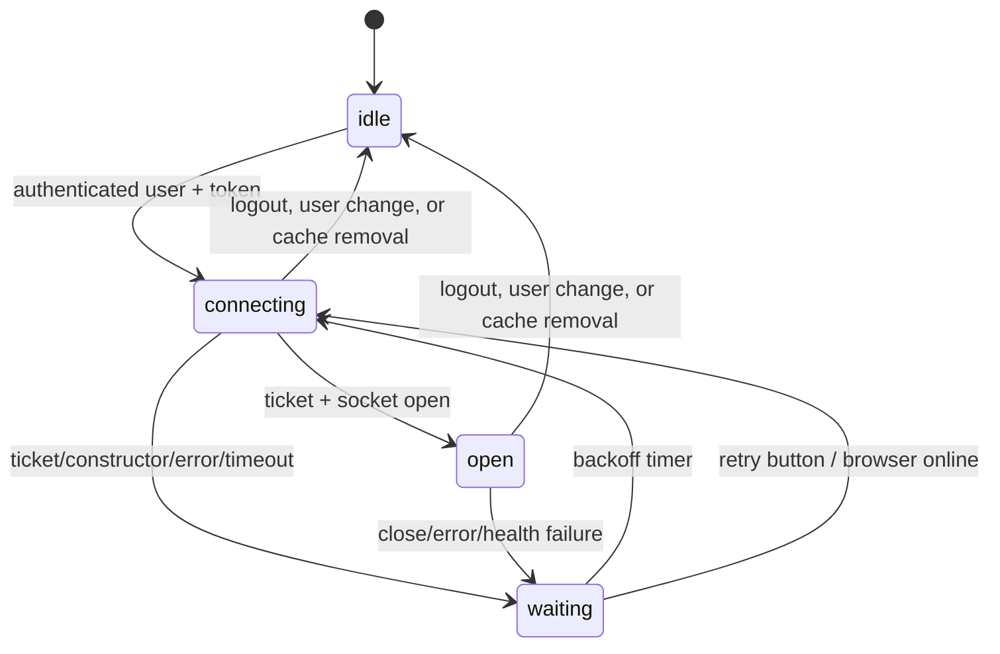

# Realtime connection and WebSocket events

## Purpose

Maintain one authenticated user socket per Frontend runtime, recover it without
reloading the page, translate validated Duely events into domain effects, and
publish eligible opponent-visible solutions at a bounded rate.

## Participants

`DuelSessionManager`, the authenticated realtime lifecycle, the realtime
transport, event parser/router, duel/invitation/group/tournament/submission
handlers, initial-sync adapter, solution publisher, browser WebSocket/timers,
RTK/Redux, Duely, and multiple tabs.

## Entry points

Authenticated user ID and access token become ready or change, the manager is
unmounted, ticket creation or connection fails, the socket opens/messages/closes,
browser connectivity returns, the retry button is pressed, logout occurs, or
another tab replaces the backend connection.

## Preconditions

Auth Redux has a token and current user. `VITE_BASE_URL` is an HTTP(S) or WS(S)
URL. Duely can issue a one-use ticket and accepts the current flat polymorphic
message contract. The backend currently registers one socket per user.

## Current behavior

The manager derives a realtime identity only when both authenticated user and
access token are present. Its effect directly starts one `DuelRealtimeSession`
for that user ID. React cleanup stops the old lifecycle on logout, unmount, or
same-runtime user change, so an old identity cannot keep dispatching after the
new session starts. Cleanup removes the manual reconnect registration,
outstanding initial sync, publisher, transport subscriptions, online listener,
timers, ticket request, and socket.

`RealtimeTransport` owns only ticket/connect/send/retry/health mechanics. It has
no Redux, RTK tag, duel, invitation, or submission imports. It models `idle`,
`connecting`, `open`, and `waiting`, fences asynchronous work with a connection
generation, aborts superseded ticket requests, applies exponential retry from
1 to 30 seconds with ±25% jitter, and reconnects established sockets after
close or error. The UI retry and browser `online` event trigger an immediate
attempt. A 15-second connect watchdog and periodic ready-state health check
recover stuck connections. Duely has no application ping/pong message, so the
health model does not invent an incompatible protocol heartbeat.

The WebSocket URL preserves the API host/path, replaces the query with the
ticket, and derives `ws:` from HTTP or `wss:` from HTTPS. HTTPS deployments
therefore cannot create a mixed-content socket.

Every transition to `open` resets the solution publisher and starts one
authoritative initial sync. Initial sync broadly invalidates all active Duel,
DuelConfiguration, DuelInvitation, Group, GroupInvitation, Submission,
Tournament, and User projections, then force-reads `/duels/active`. An active
duel promotes the session to `active`; a backend 404 resets stale active state
but preserves a pending search or accepted invitation because no active duel is
expected before `DuelStarted`. The result is accepted only while the same user
ID and captured candidate still own the session. Independently, the globally
mounted manager polls `/duels/active` every two seconds while the local phase is
`searching`. A normal manager-query 404 verifies persisted and legacy ownerless
active IDs through duel detail without waiting for the socket to open. These
bounded fallbacks repair missed transitions without creating a second socket.

Incoming text first passes the runtime parser. It accepts current flat messages
and compatibility envelopes using `event|type|name`, `data|payload`, optional
stringified payload, and camel/snake event cursors. Known events validate the
required numeric/string/null fields before routing. Invalid known events,
malformed JSON, and unknown names are isolated from domain handlers. Adding an
event consists of a local parser variant and the relevant domain handler(s),
without changing transport code.

| Event                                            | Domain behavior                                                                                              |
| ------------------------------------------------ | ------------------------------------------------------------------------------------------------------------ |
| `DuelStarted`                                    | Invalidate that duel; activate it only when it does not conflict with another active ID, otherwise reconcile |
| `DuelFinished`                                   | Invalidate duel/user/submission/tournament projections; finish only the matching current active duel         |
| `DuelCanceled` compatibility event               | Reset a currently searching flow and show cancellation UI                                                    |
| `DuelChanged` or nameless `duel_id`              | Invalidate duel/submission projections; HTTP fulfillment hydrates duel/editor state                          |
| Direct invitation create/cancel/deny             | Refresh invitation projections; change local pending state only when the payload matches                     |
| Group membership invitation create/cancel        | Refresh membership invitations and group projections                                                         |
| Group-duel invitation create/cancel              | Refresh duel invitations and group projections                                                               |
| Tournament-duel invitation create/cancel aliases | Refresh duel invitations and tournament projections                                                          |
| `OpponentSolutionUpdated`                        | Apply only to a validated cached privacy-enabled duel/task                                                   |
| `SubmissionStatusUpdated`                        | Patch lists/detail monotonically; pending visible queries also use bounded HTTP polling                      |
| `CodeRunStatusUpdated`                           | Runtime-validated but intentionally unhandled because code runs use HTTP polling                             |

When an envelope supplies an event ID, `EventCursor` suppresses repeated IDs and
numeric IDs older than the accepted numeric cursor. Current Duely flat messages
still have no ID. Without a server revision, domain handlers remain idempotent
where possible: an old finish cannot reset another active duel, invitation
invalidations are repeatable, and submission states cannot move backward from
`Running`/`Done`. Opponent solution order cannot be proven without a backend
revision.

`SolutionPublisher` polls the selected snapshot once per second through a
browser-global timer wrapper, serializes sends synchronously, and records a
snapshot only after `send` succeeds. It
deduplicates duel/task/language/solution together, retries a failed send on a
later tick, and resets after reconnect so the latest snapshot is republished.
Snapshots require an in-progress privacy-enabled duel and the current user to be
a participant. There is still no server acknowledgement or durable unload
flush.

## Backend state assumptions

Duely is authoritative for user, pending/active duel, domain entities, and
solution authorization. It still stores one process-local registered socket per
user. A second tab replaces the first, and the backend old-handler cleanup can
still remove the newer registration or cancel pending duels; Frontend reconnect
cannot solve that server ownership race. Ticket consume/expiry and replay are
also backend concerns.

## State ownership

| State                          | Owner/source of truth                       | Persistence                                       |
| ------------------------------ | ------------------------------------------- | ------------------------------------------------- |
| Socket/generation/retry/health | realtime transport in one manager lifecycle | none                                              |
| Event validation/routing       | parser/router                               | cursor mirrored in duelSession only when supplied |
| Active/pending workflow        | Duely, locally projected in duelSession     | selected fields in redux-persist                  |
| Domain projections             | Duely through RTK Query                     | RTK cache is not persisted                        |
| Own draft                      | codeEditor/Monaco until accepted by Duely   | own code/language persisted                       |
| Opponent draft                 | Duely event/detail projection               | not persisted                                     |

## Failure handling

Safe reads reconcile after every open, and active-duel polling protects the
searching workflow when an event is missed. Ticket, constructor, established
socket, and health failures automatically retry; the modal exposes an immediate
retry without `window.location.reload()`. A retry before the first successful
socket open does not clear a pending search/invitation; only a transition from
`open` to `waiting` invokes established-disconnect cleanup. A malformed or future event cannot
escape the router into unrelated handlers. Handler exceptions are caught per
handler so one domain failure does not stop dispatch of later messages.
Reconnect cannot provide exactly-once delivery because the backend emits no
cursor/replay.

## Reload and multiple tabs

Reload still recreates the runtime, but it is no longer a connection-recovery
mechanism. Persisted state is provisional until the first open initial sync.
Tabs remain independent and contend for the backend's single user socket; a
formal cross-tab owner or backend multi-connection support is still required.

## Implementation references

- `src/features/duel-session/api/duelSessionApi.ts`
- `src/features/duel-session/api/realtime/{transport,eventParser,eventRouter,eventCursor}.ts`
- `src/features/duel-session/api/realtime/domain/*Handlers.ts`
- `src/features/duel-session/api/realtime/{initialSync,session,solutionPublisher}.ts`
- `src/features/duel-session/ui/DuelSessionManager/DuelSessionManager.tsx`
- Backend `UserWebSocketHandler`, `WebSocketMessageSender`, and message types

## Test coverage

Vitest covers authenticated realtime identity, HTTP/HTTPS URL selection,
established disconnect/reconnect with backoff, ticket abort and listener/timer
cleanup, browser timer receiver binding, flat/enveloped validation, malformed/unknown events,
duplicate/out-of-order cursors, handler isolation, publisher
throttle/dedup/retry, pending-state-safe initial reconciliation and pre-open retries,
invitation-family cancellation matching, manual reconnect, logout
cleanup, and same-runtime user-session replacement.

Browser/E2E coverage is still needed for a real Nginx HTTPS socket, offline and
backend restart, multi-tab replacement, server cleanup races, and end-to-end
domain refetches.

## Current guarantees

One manager effect owns one socket lifecycle for one authenticated user ID;
transport has no business-cache knowledge; established failures retry without
page reload; HTTPS selects `wss:`; every open runs broad HTTP reconciliation;
known events are runtime-validated; supplied cursors deduplicate/order numeric
events; searching also polls active-duel state; cleanup removes owned sockets,
requests, listeners, intervals, and timeouts.

These guarantees do not imply replay, server acknowledgement, exactly-once
events, or safe simultaneous tabs.

## Open questions

Backend event/revision IDs and replay, ticket atomicity/expiry, multi-tab socket
ownership, application heartbeat semantics, solution acknowledgement, and
observable malformed-event telemetry remain cross-repository decisions.
