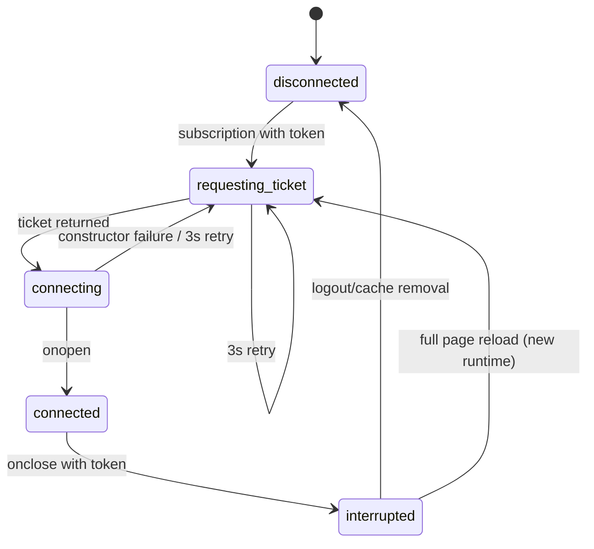

# Realtime connection and WebSocket events

## Purpose

Maintain the authenticated user socket for one tab, translate Duely messages
into Redux/cache/UI effects, and send best-effort opponent-code updates.

## Participants

DuelSessionManager, duel-session RTK cache entry, auth/user ticket endpoint,
browser WebSocket/timers, duel-session/editor Redux, RTK caches, Home/duel UI,
Duely connection manager/outbox, and multiple tabs.

## Entry points

Auth user becomes non-null, subscription cache entry is added/removed, ticket
or socket fails, socket opens/messages/closes, logout, reload, reconnect button,
or second tab connects.

## Preconditions

Auth Redux has token and current user. `VITE_BASE_URL` forms a valid URL, Duely
can issue an intended single-use ticket, and browser permits the constructed
`ws:` URL. Backend ticket lookup and clearing are separate read/write steps and
are not an atomic consume operation.

## Current behavior

The single normally-mounted manager dispatches one `subscribeToDuelStates`
query subscription. Its cache lifecycle obtains `POST /users/ticket`, constructs
`{basePath}/users/connect?ticket=...` while forcing protocol `ws:`, closes any
local prior socket, then constructs WebSocket. Tickets are random, stored on the
user, and overwritten by a new ticket. Connect reads a matching ticket, clears
it, and saves, but concurrent handlers can both read it before either clear is
committed; no expiry timestamp exists.

Ticket request or constructor failure schedules another full ticket/connect in
3000 ms after clearing the previous timer. `onopen` clears that timer and
`sessionInterrupted`, then invalidates selected broad tags. `onerror` only logs.
`onclose` resets local searching to idle, and if a token still exists sets the
interrupted modal; it does not schedule reconnect or null the socket. The modal
cannot be normally dismissed and its button reloads the page; its `onClose`
handler would only clear the flag. Logout unsubscribes; cache removal clears
interval/timer and closes the socket. The manager effect itself has no unmount
cleanup, a risk for abnormal remounts.

The parser accepts flat backend objects or envelopes with `event|type|name`,
`data|payload`, camel/snake last-event ID, and stringified payload. Event names
remove nonletters and lowercase. Payloads are TypeScript-cast, not runtime-
validated. Current Duely sends flat polymorphic JSON with `type` and fields; it
does not send `lastEventId`, so the persisted field remains unused and no replay
cursor is sent on reconnect.

| Event name | Current backend payload | Redux mutation | Cache mutation | Navigation/UI effect |
| --- | --- | --- | --- | --- |
| `DuelStarted` | `duel_id` | active ID; phase becomes active; clear search | invalidate Duel ID | Navigation only in Home/session-button effects |
| `DuelFinished` | `duel_id` | reset whole session | Duel ID + User ME | duel result comes from refetch; can reset unrelated active duel |
| `DuelCanceled` | opponent optional | reset; canceled modal | None | Client handles it, current backend has no such type |
| `DuelChanged` or nameless object with `duel_id` | current backend only `duel_id` | last ID only; full noncurrent envelope could overwrite code | invalidate Duel ID | task/result changes after refetch |
| `DuelInvitation` | opponent/config | None | DuelInvitation LIST | invitation list refetch |
| `DuelInvitationCanceled` | opponent/config | maybe phase idle if match | DuelInvitation LIST | waiting/search can stop |
| `DuelInvitationDenied` | opponent/config | matching search -> idle + canceled dialog | DuelInvitation LIST | denial modal |
| `TournamentDuelInvitation` (alias accepted) | tournament/opponent/config | None | DuelInvitation LIST | incoming list refetch |
| tournament-canceled aliases | no current backend message | maybe phase idle when tournament ID matches | DuelInvitation LIST | dead compatibility path currently |
| `GroupInvitation` | group/role/inviter | None | GroupInvitation LIST | membership invitation refetch |
| `GroupInvitationCanceled` | group fields | None | GroupInvitation LIST | removal refetch |
| `GroupDuelInvitation` / canceled | backend emits both | None | None | Unknown and silently ignored: confirmed mismatch |
| `OpponentSolutionUpdated` | duel/task/language/solution | opponent editor maps when cached privacy flag true | None | opponent tab changes |
| `SubmissionStatusUpdated` | duel/submission/status/message/verdict | None | patch existing detail/all cached duel lists; protect `Done` | rows/detail update if present |
| `CodeRunStatusUpdated` | run/status/error | None | None | Unhandled; run UI uses HTTP polling |
| Unknown/malformed | arbitrary | only last ID may be stored before unknown dispatch; malformed ignored | None | console warning only for parse failure |



Labels except `sessionInterrupted` are conceptual; no socket-state enum exists.

```mermaid
sequenceDiagram
    participant A as Tab A
    participant B as Duely connection registry
    participant T as Tab B
    A->>B: connect as user
    T->>B: connect same user
    B->>A: close "Replaced by new connection"
    B->>B: register Tab B socket
    A->>B: old finally may remove user entry and cancel pending duels
    A-->>A: phase searching -> idle; interrupted modal
    Note over B,T: Tab B socket may stay open but no longer be registry target
```

## Client state transitions

`sessionInterrupted: false -> true on close -> false on open/modal handler`;
`phase: searching -> idle on any close`; socket conceptual flow is above.
Messages set `idle/searching/active` without event-order checks. `lastEventId`
changes only if a noncurrent envelope supplies it.

## Backend state assumptions

Duely is authoritative and keeps one process-local registered socket/user. On
the ordinary handler-exit path, `finally` attempts to close the socket, remove
the user registration, and send `CancelPendingDuels`. If current-socket
`CloseAsync` throws, the later removal and pending cleanup can be skipped. An old
handler can instead reach those statements after replacement and remove the new
socket registration. Frontend assumes ticket response/string, flat event
fields/enums, and server authorization of `SolutionUpdated`. No replay endpoint
reconciles missed events.

## State ownership

| State | Owner/source of truth | Redux | RTK Query | local state | sessionStorage | localStorage | Survives reload |
| --- | --- | --- | --- | --- | --- | --- | --- |
| Socket/timers/last sent code | tab subscription | No | cache lifecycle | closure | No | No | No |
| Interrupted flag/phase/active ID | client from backend | duelSession | No | manager reconnect flag | No | phase/ID persisted | Partial |
| Event cursor | no current producer | duelSession | No | No | No | persisted field | Yes but unused |
| Domain data | Duely | partial workflow | endpoint caches | No | No | No | No |
| Opponent code | Duely messages/details | codeEditor | Duel supplies initial | Monaco mirror | code tab only | not whitelisted | No |

## UI effects

Close shows a blocking no-close-button modal; reload button displays local
"reconnecting" until page unload. Searching loader disappears immediately on
close. Events invalidate lists/details or mutate code/submissions, but socket
manager itself does not navigate; only mounted workflow components do.

## Network effects

Ticket and connection retries are infinite only before a socket object opens.
On open, invalidations that actually match can trigger concurrent requests.
Socket receives flat messages and sends full selected-task solution/language at
most once per second when changed and cached privacy flag is true. No ack exists.

## Idempotency and duplicate handling

No event-ID/order dedupe exists. Repeated invitation events repeat invalidation;
submission patches protect terminal `Done` but unknown entries are ignored;
duplicate/old duel starts/finishes repeat workflow resets. Code send suppresses
only equality against one in-memory last-selected payload.

## Ordering assumptions

Start/finish/change events are assumed chronological and relevant to current
session. HTTP start completion is assumed before `DuelStarted`, which is not
guaranteed. Connection replacement/cleanup has no generation token. Payload
casts assume backend names/fields remain compatible.

## Failure handling

Ticket/constructor failures log and retry. Socket error alone logs; close needs
manual reload. The backend's ordinary `finally` path attempts registration and
pending-state cleanup, but process termination or an uncaught current-socket
`CloseAsync` failure can prevent it. Malformed JSON/string payload is ignored.
Unknown events are silent. Missed events rely on later HTTP refetch, but
reconnect invalidation does not cover all real tags. Mixed-content `ws:` may
prevent connection under HTTPS.

## Reload and multiple tabs

Reload destroys/recreates socket with a new ticket and empty cache. Each tab
opens its own socket and has independent timers/cache/sessionStorage but shared
persisted Redux bytes. Backend replacement interrupts the old tab; if the old
handler reaches cleanup after the new registration, it can cancel pending state
and remove the new registry entry. Conversely, a close failure can skip that
cleanup. Tabs have no leader election.

## Implementation references

- `src/features/duel-session/api/duelSessionApi.ts`
- `src/features/duel-session/ui/DuelSessionManager/DuelSessionManager.tsx`
- `src/features/duel-session/lib/const.ts`
- Backend `UserWebSocketHandler`, `WebSocketMessageSender`, message types
- CoDuels-Backend: `docs/processes/user-connection-lifecycle.md`

## Test coverage

- **Existing tests/MSW:** none.
- **Needed unit/integration:** URL/scheme, ticket retries, lifecycle cleanup,
  every event/flat-envelope/string payload, malformed/unknown/duplicate/order,
  tag/manual patches, code send gating.
- **Needed browser/E2E:** real socket open/close/reload, expired ticket, offline,
  early event, missed event/refetch, two tabs/replacement/search cleanup, HTTPS,
  logout/remount, and privacy/spectator flows.

## Current guarantees

Normal app tree has one subscription per tab; pre-open failures retry at 3000
ms; open clears the scheduled timer; cache removal clears owned timers/socket;
current flat backend event names listed as handled produce the documented
mutations; code sync checks cached privacy flag and open readyState. These facts
do not guarantee atomic single-use ticket consumption or backend cleanup after
every connection termination.

## Open questions

Automatic reconnect/replay, scheme selection, event validation/versioning,
multi-tab connection ownership, disconnect cleanup semantics, and complete
cache reconciliation are unresolved.

## Proposed requirements

Use secure scheme derived from base URL; model socket state/generation; reconnect
with backoff and replay cursor or full reconciliation; runtime-validate/version
events; handle all backend message types; add explicit frontend subscription
cleanup on unmount; elect a cross-tab owner or support multi-connection backend;
and E2E-test replacement.
