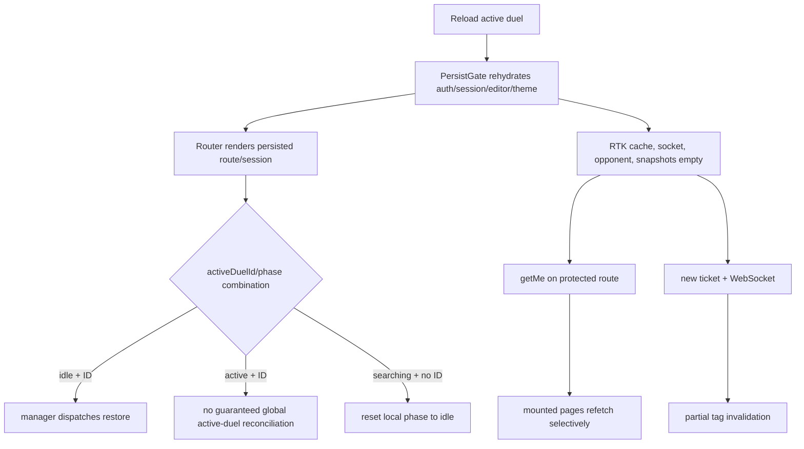

# Reload recovery and multiple tabs

## Purpose

Explain what survives reload, what is revalidated, how browser storage scopes
differ, and where independent tabs can conflict.

## Participants

redux-persist/localStorage, sessionStorage hooks, RTK Query, Router, auth and
duel-session managers, editor/anti-cheat, Duely, browser lifecycle, and tabs.

## Entry points

Reload, close/reopen, duplicate/open another tab, back/forward/deep link, offline
restart, logout/login, storage event from another tab, token refresh, socket
replacement, and browser crash.

## Preconditions

Browser storage is available and contains parseable current-version data.
PersistGate waits for Redux rehydration; stored data remains a provisional cache
until backend queries/events confirm it.

## Current behavior

Redux localStorage keys are `persist:auth`, `persist:duelSession`,
`persist:codeEditor`, and `persist:theme`, each version 1 with whitelists and no
migration. Other localStorage keys include `duel-configurations` and
`duel:{duelId}:resultDismissed`. Home sessionStorage keys are
`home.showStartPanel`, `home.showConfigPicker`, `home.showConfigCreateModal`,
`home.showFriendlyForm`, `home.friendlyNickname`, `home.selectedConfigId`,
`home.selectedDefaultConfig`, `home.pendingInvitationNickname`,
`home.waitingForStart`, and `home.pendingGroupInvitationId`. Duel UI also uses
`duel.{duelId}.codeTab` and `duel-run-panel:{duelId}:{task}`.

RTK cache, opponent code, session interruption, task snapshots, anti-cheat
queue, socket, mutation state, and most forms do not survive. Home/run panel
session values survive same-tab reload; run state may remain `running` without a
run ID/resume mechanism. Custom storage hooks recover parse errors to initial
values and silently ignore write errors. No BroadcastChannel/storage listener
coordinates Redux. Backend currently permits one registered socket per user;
the later tab replaces the earlier, and old cleanup can remove/cancel current
state as detailed in [realtime connection](realtime-connection.md).

## Client state transitions

Rehydration restores only whitelisted fields. Manager can restore active phase
when an ID exists with idle; a thunk invocation inside an extraReducer is
ineffective unless later dispatched by the manager. Reload resets searching/no
active to idle without backend verification. New HTTP/events then overwrite
parts of restored state.

## Backend state assumptions

Duely is authoritative for auth, pending/active duel, domain entities and socket
ownership. Persisted client fields are not proof. Current reconciliation is
selective: Home queries active duel, while direct routes or stale searching state
do not always perform equivalent verification.

## State ownership

localStorage is origin-wide/shared across tabs; sessionStorage is tab-specific;
React/RTK/socket/module state is process-specific; URL/history is browser-tab
navigation; backend owns domain truth. No explicit arbiter merges these scopes.

## UI effects

PersistGate produces a blank gate until rehydrated. Stored phase/forms can show
stale searching/waiting/modals. Empty RTK cache produces loaders/refetches.
Another tab's logout, finish, role change, or code edit is not immediately
reflected unless backend/socket/storage side effects happen to expose it.

## Network effects

Each tab independently calls `getMe`, opens a ticket/socket, subscribes queries,
refreshes tokens, and sends code/actions. Socket open invalidation is incomplete.
No cross-tab request leader exists, increasing duplicate starts/accepts/submits.

## Idempotency and duplicate handling

Reload can replay user actions manually but there is no durable mutation outbox
or idempotency key. Persist writes are last-writer wins. Server queries are safe
to repeat; domain mutations rely on backend duplicate handling.

## Ordering assumptions

Persist rehydration precedes child render, not backend truth. Tab storage writes,
token refreshes, socket replacement/cleanup, HTTP responses, debounces, and
events have no shared order or generation.

## Failure handling

Corrupt custom-storage values fall back; schemas/migrations are absent. Offline
refresh can log out. Crash/unload loses queues and final code/status knowledge.
There is no unified stale-session screen; the socket interruption modal offers
full reload as recovery.

## Reload and multiple tabs

This process is inherently tab-sensitive. A second socket replaces the first;
tabs retain independent Redux despite shared persistence bytes. Stale tabs may
rewrite logged-out auth, old phase, source, or theme. sessionStorage waiting/form
values can be shown under a subsequently logged-in different user.

## Implementation references

- `src/app/store.ts`, providers, router
- auth/duelSession/codeEditor/theme persist configurations
- `src/shared/lib/use{Local,Session}Storage.tsx`
- Home, DuelInfo, CodePanel, run panel storage call sites
- duel-session/auth API managers

## Test coverage

- **Existing tests:** none.
- **Needed integration:** every whitelist/key/reset, corrupted/old schemas,
  protected-route reconciliation, active/searching combinations, storage errors.
- **Needed multi-context E2E:** two tabs login/logout/refresh/socket, edit/search/
  accept/submit, reload each phase, offline/crash, duplicate tab, user switch.

## Current guarantees

Only documented whitelisted Redux fields are restored; RTK and in-memory queues
start empty; same-tab sessionStorage normally survives reload; backend requests
still re-authorize operations; editor code clears on local logout action.

## Open questions

Supported multi-tab model, socket ownership, storage user scoping/encryption/TTL,
active/search reconciliation, stale-tab fencing, migrations, and recovery UX are
unsettled.

## Proposed requirements

Treat restored state as explicitly unverified; reconcile auth/session globally;
scope/version/purge all storage by user; coordinate tabs and socket leadership;
fence stale writers; make mutations idempotent; test a formal reload/tab matrix.

