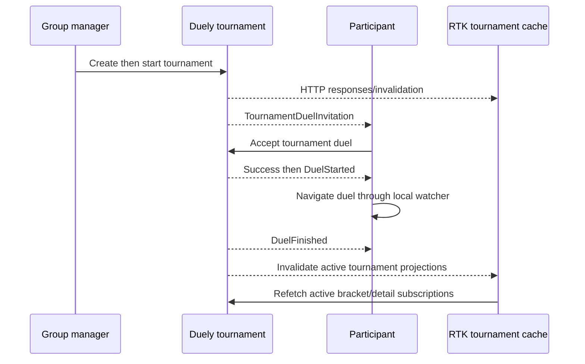

# Tournaments

## Purpose

Describe tournament creation, participant/configuration setup, start, bracket
viewing, tournament-duel invitation acceptance, and duel-result refresh.

## Participants

Group tournament list/detail pages, four-step create form, Creator/Manager,
participants, tournament RTK API, invitation aggregation, duel session, Duely,
and WebSocket.

## Entry points

`/groups/:groupId/tournaments`, `/groups/:groupId/tournaments/:tournamentId`,
create, start, accept a tournament duel from Home, open a duel, return/reload,
and receive tournament invitation or duel-finished events.

## Preconditions

The user can access the group. Duely validates management permission, selected
participants/configuration, matchmaking strategy, tournament status, and duel
invitation eligibility. Status strings are `New`, `InProgress`, `Finished`;
strategies include `SingleEliminationBracket` and `GroupStage`.

## Current behavior

Creation uses four component-state steps and posts participant nicknames plus
configuration. The participant step separates accepted group members from
pending membership invitations; only accepted members with a nickname are
selectable, while pending invitees remain visible with an unavailable status.
Success invalidates the group tournament tag. Detail is cached by tournament ID;
start invalidates both entity and group list. Start UI is visible for `New` to
current Creator/Manager. A validated
`TournamentDuelInvitation` invalidates duel-invitation and tournament
projections. Acceptance invalidates tournament entity and invitations, then
persists opponent/config/type/tournament ID, sets Home waiting, and awaits
`DuelStarted`. Finishing a duel invalidates duel, current user, and all active
tournament projections so bracket data refetches. There is no automatic return
to the originating tournament.

## Client state transitions

Form step/selection changes are local. Tournament DTO state changes only after
query/mutation refresh. Accepted duel moves duelSession to searching then active.
Tournament ID is persisted for cancellation matching, but a current generic
cancellation event without that ID may fail to reset the state.

## Backend state assumptions

Duely owns bracket/group-stage scheduling, standings, invitation generation,
status transitions, and permission. The client assumes returned bracket data is
self-consistent and does not locally calculate advancement.

## State ownership

Tournament domain data is backend-owned and RTK-cached. Creation form is
component state. Accepted duel context is split across persisted duelSession and
Home sessionStorage. Route holds group/tournament identity; origin is not stored
for post-duel navigation.

## UI effects

Pages render status/strategy/bracket and conditionally show start. Participants
see tournament-duel invitations in Home. Stale detail can show an old round or
status after another duel finishes until a refetch/remount or matching mutation.

## Network effects

Queries use entity ID and group-scoped tags. Create/start/accept mutate Duely.
Reconnect and duel-finish handling invalidate the complete `Tournament` tag
type, matching entity and `GROUP-{id}` projections.

## Idempotency and duplicate handling

No client idempotency keys cover create/start/accept. Buttons' loading state is
the main duplicate guard. Repeated invalidation/refetch is safe; a repeated
accept/start relies on backend state conflict handling.

## Ordering assumptions

The client assumes start response/refetch follows backend transition and accept
response precedes `DuelStarted`. Tournament detail refetch is triggered by
`DuelFinished`, but without an entity revision a late HTTP response can still
precede or overwrite another concurrent transition.

## Failure handling

Create form remains local on request failure; reload loses it. Start/accept
errors surface through their UI paths. Lost accept response and missed events
have no dedicated tournament-session reconciliation. Unknown cancellation does
not reliably release a tournament waiting state.

## Reload and multiple tabs

Reload loses creation progress and RTK bracket cache, causing a fresh query.
Accepted context persists partially; Home waiting is same-tab only. Tabs can
start/accept concurrently and hold independently stale bracket caches.

## Implementation references

- tournament pages/features/entities under `src/pages/group` and
  `src/entities/tournament`
- `src/pages/home/ui/HomePage.tsx`
- `src/features/duel-session/api/duelSessionApi.ts`
- `src/features/duel-session/model/duelSessionSlice.ts`

## Test coverage

- **Existing tests:** realtime router/session tests cover validated event
  isolation and reconnect reconciliation entry.
- **Needed integration:** role/status matrix, both strategies, exact tags/events,
  duplicate start/accept, bracket refresh after finish, cancellation fields.
- **Needed E2E:** full create/start/round flow, participant acceptance, reload
  each form step, post-duel bracket update, access revocation, and two tabs.

## Current guarantees

The client delegates bracket logic and authorization to Duely; successful
create/start invalidates their intended current tags; acceptance retains the
tournament ID; opening a detail after cache loss fetches current backend state.

## Open questions

Post-duel return, real-time bracket event, cancellation payload, tournament
version/revision, form recovery, and idempotency of scheduling actions remain
undefined.

## Proposed requirements

Push or invalidate a versioned tournament revision after every relevant duel;
align reconnect tags; preserve explicit origin; include tournament/invitation ID
in all events; and make create/start/accept idempotent and order-safe.
